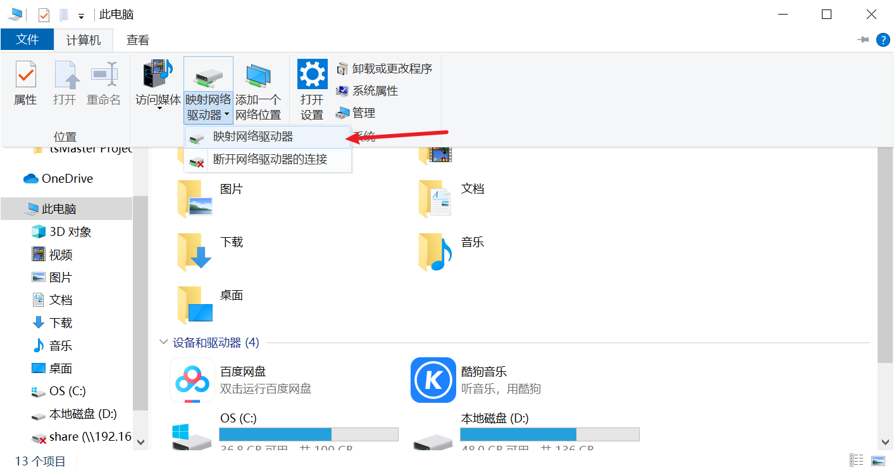
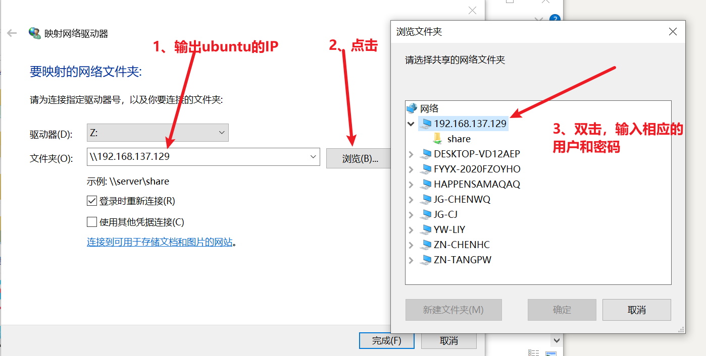

### 功能：

- 脚本文件，实现安装samba相关的软件，实现window和ubuntu之间的文件共享

### 使用：

#### ubuntu相关操作：

- 打开smb.conf，拉到最底下，有如下解释

```bash
[share]		//共享后的文件名
comment = Share Folder require password
browseable = yes
path = /workspace	//需要共享的文件路径
create mask = 0777
directory mask = 0777
valid users = root	//允许的用户连接,和底下输入一致
force user = nobody
force group = nogroup
public = yes
writable = yes
available = yes
```

需要共享的文件路径，最好设定一下目录权限chmod 777 文件名

- 运行samba.sh，即~./samba.sh（可能需要相应更改下权限），相应结果如下:

```bash
samba isntalled
smbclient isntalled
/etc/samba/smb.conf.back1 exist
[sudo] tpw 的密码：       //<-相应的系统的密码
[ ok ] Restarting nmbd (via systemctl): nmbd.service.
[ ok ] Restarting smbd (via systemctl): smbd.service.
[ ok ] Restarting samba-ad-dc (via systemctl): samba-ad-dc.service.
input user:		//<-这里输出后面远程连接允许的用户，和文件smb.conf里的valid users一致
root
New SMB password:	//<-允许用户的登录密码
Retype new SMB password:

```

- 运行samba.sh，会将原/etc/samba/smb.conf拷贝一份叫/smb.conf.back1，原先的smb.conf会替换成新的

#### window相关操作：

- 打开我的电脑->计算机->映射网络驱动器



